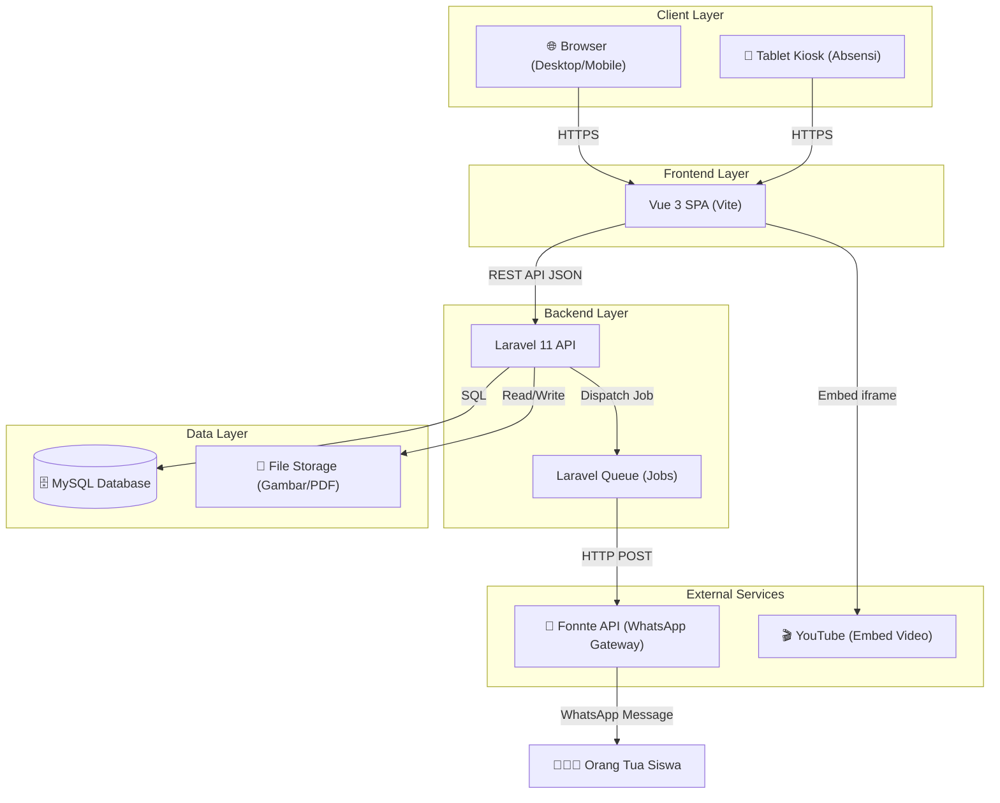

# System Architecture
## Sistem Informasi Terpadu SMPN 1 Muara Kaman

> **Versi:** 2.0 (Revisi — ditambahkan WhatsApp Gateway & Absensi)
> **Tanggal:** 18 Agustus 2026

---

### 1. High-Level Architecture
Sistem ini menggunakan arsitektur **Decoupled (Client-Server)** dengan pemisahan yang jelas antara backend dan frontend, ditambah integrasi ke layanan pihak ketiga (WhatsApp Gateway):

- **Frontend (Client):** Single Page Application (SPA) menggunakan **Vue 3** + **Vite**. Bertanggung jawab untuk rendering UI, interaksi pengguna, dan state management.
- **Backend (Server):** RESTful API menggunakan **Laravel 11**. Menangani business logic, autentikasi, otorisasi, integrasi WhatsApp, dan interaksi database.
- **Database:** **MySQL 8.0+** sebagai penyimpanan data utama.
- **WhatsApp Gateway:** **Fonnte API** untuk mengirim notifikasi WhatsApp ke orang tua siswa saat check-in/check-out absensi.
- **File Storage:** Local storage (disk server) untuk upload gambar dan berkas PDF PPDB.

---

### 2. Diagram Arsitektur

---

### 3. Alur Komunikasi (Data Flow)

#### A. Alur Umum (Halaman Publik)
1. Pengguna membuka browser → web server menyajikan file statis Vue (HTML/JS/CSS).
2. Vue melakukan routing di sisi klien.
3. Vue melakukan fetch ke API Laravel untuk data dinamis (berita, galeri, info PPDB).
4. Laravel merespons dengan JSON.
5. Vue merender tampilan.

#### B. Alur PPDB
1. Calon siswa mengisi formulir + upload 1 file PDF gabungan.
2. Vue mengirim `multipart/form-data` ke API Laravel.
3. Laravel memvalidasi, menyimpan file ke storage, menyimpan data ke `ppdb_registrations`.
4. Sistem generate nomor pendaftaran unik → dikembalikan ke user untuk cetak bukti.

#### C. Alur Absensi Digital (Check-in/Check-out)
1. Siswa membuka halaman absensi (dari tablet kiosk atau HP).
2. Siswa mengetik PIN 4 digit → Vue mengirim `POST /api/attendance/checkin` ke Laravel.
3. Laravel memverifikasi PIN (hash compare):
   - Jika **belum ada record hari ini** → buat record baru dengan `check_in_time`.
   - Jika **sudah ada record tapi belum check-out** → update `check_out_time`.
4. Laravel men-dispatch **Queue Job** untuk mengirim notifikasi WhatsApp.
5. Job memanggil **Fonnte API** dengan pesan:
   - Check-in: *"✅ [Nama] telah hadir di sekolah pukul [HH:MM]"*
   - Check-out: *"🏠 [Nama] telah pulang dari sekolah pukul [HH:MM]"*
6. Response dari Fonnte disimpan ke `notification_logs`.

---

### 4. Deployment Strategy

| Komponen | Platform | Keterangan |
|---|---|---|
| **Frontend** | Sama server / subdomain | Di-build lalu dilayani oleh Nginx |
| **Backend** | VPS (Niagahoster/DigitalOcean) | Nginx + PHP-FPM |
| **Database** | Server yang sama | MySQL 8.0+ |
| **Domain** | `.sch.id` | Domain resmi sekolah |
| **SSL** | Let's Encrypt / Cloudflare | HTTPS gratis |
| **Security** | Cloudflare WAF | Anti-DDoS, sesuai proposal |
| **WhatsApp** | Fonnte API | Berlangganan (harga mulai ~Rp50rb/bulan) |

---

### 5. Catatan Teknis WhatsApp Gateway (Fonnte)

- **Fonnte** dipilih karena: murah, mudah integrasi (REST API sederhana), populer di Indonesia, tidak perlu WhatsApp Business API resmi yang mahal.
- Pengiriman notifikasi dilakukan secara **asynchronous** via Laravel Queue agar tidak memperlambat proses absensi.
- Jika pengiriman gagal, sistem akan mencatat di `notification_logs` dengan status `failed` dan bisa di-retry.
