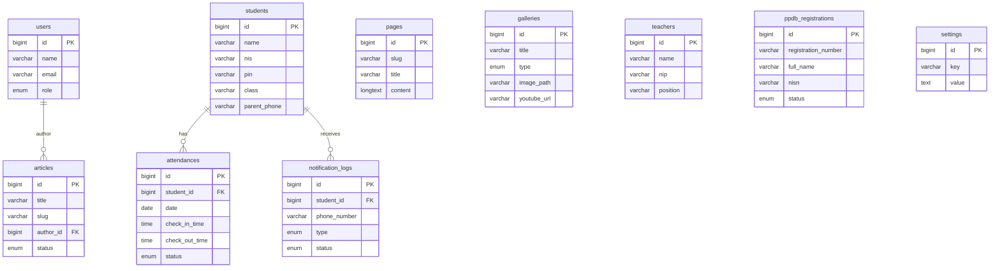

# Database Schema
## Sistem Informasi Terpadu SMPN 1 Muara Kaman

> **Versi:** 2.0 (Revisi — diselaraskan dengan seluruh 6 modul Proposal)
> **Tanggal:** 18 Agustus 2026

---

### 1. Tabel `users`
Digunakan untuk autentikasi admin dan staf.

| Kolom | Tipe | Keterangan |
|---|---|---|
| `id` | PK, bigint | Auto increment |
| `name` | varchar | Nama lengkap |
| `email` | varchar, unique | Email login |
| `password` | varchar | Password (hashed) |
| `role` | enum: `admin`, `staff` | Hak akses |
| `remember_token` | varchar | Token sesi |
| `timestamps` | — | created_at, updated_at |

---

### 2. Tabel `pages` *(BARU)*
Menyimpan konten halaman statis yang bisa diedit via admin dashboard.

| Kolom | Tipe | Keterangan |
|---|---|---|
| `id` | PK, bigint | Auto increment |
| `slug` | varchar, unique | Identifier halaman (misal: `sejarah`, `visi-misi`, `sambutan-kepsek`) |
| `title` | varchar | Judul halaman |
| `content` | longtext | Isi konten (HTML/Markdown) |
| `image_path` | varchar, nullable | Gambar header halaman |
| `timestamps` | — | created_at, updated_at |

**Contoh data awal:**
- `slug: sejarah` → Sejarah sekolah
- `slug: visi-misi` → Visi & Misi
- `slug: sambutan-kepsek` → Sambutan Kepala Sekolah
- `slug: struktur-organisasi` → Struktur Organisasi
- `slug: fasilitas` → Daftar Fasilitas
- `slug: ekstrakurikuler` → Daftar Ekskul
- `slug: kontak` → Info Kontak

---

### 3. Tabel `articles` (Berita / Pengumuman)
Digunakan untuk konten dinamis berita dan pengumuman.

| Kolom | Tipe | Keterangan |
|---|---|---|
| `id` | PK, bigint | Auto increment |
| `title` | varchar | Judul berita |
| `slug` | varchar, unique | URL-friendly slug |
| `content` | longtext | Isi artikel (HTML) |
| `image_path` | varchar, nullable | Thumbnail/featured image |
| `author_id` | FK → `users.id` | Penulis |
| `status` | enum: `draft`, `published` | Status publikasi |
| `published_at` | datetime, nullable | Tanggal terbit |
| `timestamps` | — | created_at, updated_at |

---

### 4. Tabel `galleries` *(BARU)*
Menyimpan data galeri foto dan link video YouTube.

| Kolom | Tipe | Keterangan |
|---|---|---|
| `id` | PK, bigint | Auto increment |
| `title` | varchar | Judul/caption |
| `type` | enum: `photo`, `video` | Jenis media |
| `image_path` | varchar, nullable | Path file foto (jika type=photo) |
| `youtube_url` | varchar, nullable | Link YouTube (jika type=video) |
| `sort_order` | integer, default 0 | Urutan tampil |
| `timestamps` | — | created_at, updated_at |

---

### 5. Tabel `teachers` *(BARU)*
Menyimpan data guru dan staf sekolah.

| Kolom | Tipe | Keterangan |
|---|---|---|
| `id` | PK, bigint | Auto increment |
| `name` | varchar | Nama lengkap |
| `nip` | varchar, nullable | Nomor Induk Pegawai |
| `position` | varchar | Jabatan (Guru Matematika, Kepala Sekolah, dll) |
| `photo_path` | varchar, nullable | Foto profil |
| `phone` | varchar, nullable | Nomor telepon |
| `email` | varchar, nullable | Email |
| `is_active` | boolean, default true | Status aktif |
| `sort_order` | integer, default 0 | Urutan tampil |
| `timestamps` | — | created_at, updated_at |

---

### 6. Tabel `ppdb_registrations`
Menyimpan data pendaftaran calon siswa baru (PPDB).

| Kolom | Tipe | Keterangan |
|---|---|---|
| `id` | PK, bigint | Auto increment |
| `registration_number` | varchar, unique | Nomor pendaftaran (auto-generate) |
| `full_name` | varchar | Nama lengkap calon siswa |
| `nisn` | varchar, unique | NISN |
| `place_of_birth` | varchar | Tempat lahir |
| `date_of_birth` | date | Tanggal lahir |
| `gender` | enum: `L`, `P` | Jenis kelamin |
| `religion` | varchar | Agama |
| `previous_school` | varchar | Asal sekolah (SD) |
| `address` | text | Alamat lengkap |
| `parent_name` | varchar | Nama orang tua/wali |
| `parent_phone` | varchar | Nomor HP orang tua/wali |
| `document_path` | varchar, nullable | **1 file PDF gabungan** (semua berkas digabung) |
| `status` | enum: `pending`, `verified`, `accepted`, `rejected` | Status pendaftaran |
| `notes` | text, nullable | Catatan admin |
| `timestamps` | — | created_at, updated_at |

---

### 7. Tabel `students` *(BARU)*
Menyimpan data siswa aktif untuk modul absensi digital.

| Kolom | Tipe | Keterangan |
|---|---|---|
| `id` | PK, bigint | Auto increment |
| `name` | varchar | Nama lengkap siswa |
| `nis` | varchar, unique | Nomor Induk Siswa |
| `nisn` | varchar, unique | NISN |
| `class` | varchar | Kelas (contoh: 7A, 8B, 9C) |
| `pin` | varchar | PIN 4 digit (hashed) — **auto-generate oleh sistem** |
| `gender` | enum: `L`, `P` | Jenis kelamin |
| `parent_name` | varchar, nullable | Nama orang tua |
| `parent_phone` | varchar | Nomor HP orang tua (**wajib, untuk notifikasi WhatsApp**) |
| `is_active` | boolean, default true | Status aktif |
| `timestamps` | — | created_at, updated_at |

> **Catatan PIN:**
> - PIN terdiri dari 4 digit angka unik, di-generate otomatis saat siswa dibuat.
> - Admin bisa reset/regenerate PIN kapan saja.
> - Admin bisa generate PIN massal per kelas.
> - PIN disimpan dalam bentuk **hashed** untuk keamanan.

---

### 8. Tabel `attendances` *(BARU)*
Menyimpan catatan absensi harian siswa (check-in & check-out).

| Kolom | Tipe | Keterangan |
|---|---|---|
| `id` | PK, bigint | Auto increment |
| `student_id` | FK → `students.id` | Relasi ke siswa |
| `date` | date | Tanggal absensi |
| `check_in_time` | time, nullable | Jam masuk (check-in) |
| `check_out_time` | time, nullable | Jam pulang (check-out) |
| `status` | enum: `hadir`, `izin`, `sakit`, `alpha` | Status kehadiran |
| `notes` | text, nullable | Catatan (alasan izin/sakit) |
| `timestamps` | — | created_at, updated_at |

> **Constraint:** `UNIQUE(student_id, date)` — satu siswa hanya punya satu record per hari.
>
> **Alur Check-in/Check-out:**
> 1. Siswa input PIN pertama kali hari itu → record baru dengan `check_in_time` terisi, `status = hadir`.
> 2. Siswa input PIN kedua kali hari itu → `check_out_time` terisi pada record yang sama.
> 3. Setiap check-in dan check-out mengirim **notifikasi WhatsApp** ke `parent_phone` siswa.

---

### 9. Tabel `notification_logs` *(BARU)*
Menyimpan log pengiriman notifikasi WhatsApp untuk audit dan debugging.

| Kolom | Tipe | Keterangan |
|---|---|---|
| `id` | PK, bigint | Auto increment |
| `student_id` | FK → `students.id` | Relasi ke siswa |
| `phone_number` | varchar | Nomor tujuan |
| `message` | text | Isi pesan yang dikirim |
| `type` | enum: `checkin`, `checkout`, `ppdb` | Jenis notifikasi |
| `status` | enum: `sent`, `failed`, `pending` | Status pengiriman |
| `response` | text, nullable | Response dari API WhatsApp |
| `timestamps` | — | created_at, updated_at |

---

### 10. Tabel `settings`
Menyimpan konfigurasi website yang bisa diubah tanpa mengubah code.

| Kolom | Tipe | Keterangan |
|---|---|---|
| `id` | PK, bigint | Auto increment |
| `key` | varchar, unique | Kunci pengaturan |
| `value` | text | Nilai pengaturan |
| `timestamps` | — | created_at, updated_at |

**Contoh data awal:**

| key | value |
|---|---|
| `school_name` | SMPN 1 Muara Kaman |
| `school_address` | Jl. ... Muara Kaman, Kutai Kartanegara |
| `contact_email` | info@smpn1muarakaman.sch.id |
| `contact_phone` | 0541-xxxxxxx |
| `ppdb_is_open` | true |
| `ppdb_year` | 2026/2027 |
| `fonnte_api_token` | (token API Fonnte untuk WhatsApp) |
| `school_logo_path` | /storage/logo.png |

---

### Diagram Relasi (ERD)

---

**Total: 10 Tabel** untuk mendukung seluruh 6 modul yang dijanjikan di Proposal Biaya.
